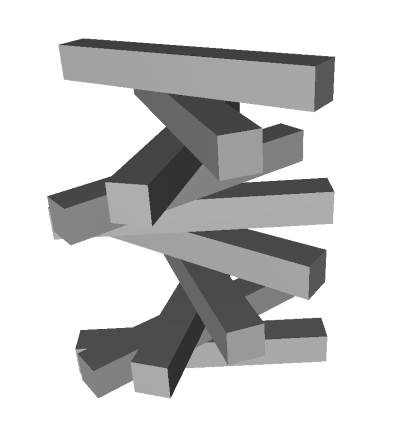

# Hypo

Hypo enables you to declaritively build 2D and 3D geometry using TypeScript.

Hypo is a C++ application that uses [Reify](https://github.com/aabtop/reify) to offer a TypeScript interface for describing 2D and 3D geometry.  The geometry description is then passed on to code which interacts with [CGAL](https://www.cgal.org/) in order to produce the concrete geometric object data which is ultimately output to a file.

Hypo can generate 2D or 3D geometry.  When Hypo calls a TypeScript function that returns a `Region2` type, a [SVG file](https://en.wikipedia.org/wiki/Scalable_Vector_Graphics) representing 2D geometry will be output.  When Hypo calls a TypeScript function that returns a `Region3` type, a [STL file](https://en.wikipedia.org/wiki/STL_(file_format)) representing 3D geometry will be output.

Hypo runs TypeScript within a constrained runtime without access to I/O, so it is safe to run arbitrary user code without fear that it will open a file or access the network. Hypo can access any of the exported symbols of the input TypeScript, in accordance with the [TypeScript Modules](https://www.typescriptlang.org/docs/handbook/modules.html) framework.

While not currently packaged as such, Hypo may also be used as a library, where it may offer an interface for generating geometry from TypeScript, completely in-memory.  As a library, Hypo can also be used to offer access to the
Reify types, enabling one to write an application that analyzes the returned
geometry descriptions.

Hypo is heavily inspired by [OpenSCAD](https://www.openscad.org/).  The primary difference between the two is the choice of input language.  Where OpenSCAD offers a custom language, Hypo offers TypeScript.

## Example Usage

### Eyes (2D)

As an example, let's say you have the file [eyes.ts](./src/example_scripts/eyes.ts):

``` ts
import * as h from 'hypo';

export function Eye(center: h.Vec2) {
  let eye_area = h.Intersection2({
    regions: [
      h.CircleAsPolygon({
        circle: {radius: 10, center: [center[0], center[1] - 7.5]},
        num_points: 100
      }),
      h.CircleAsPolygon({
        circle: {radius: 10, center: [center[0], center[1] + 7.5]},
        num_points: 100
      })
    ]
  });

  let pupil = h.CircleAsPolygon(
      {circle: {radius: 2, center: [center[0], center[1]]}, num_points: 50});

  return h.Difference2({a: eye_area, b: pupil});
}

export function Main() {
  return h.Union2({regions: [Eye([10, 10]), Eye([30, 10])]});
}
```

When we call the hypo with a reference to the exported function `Main` via:

``` 

hypo eyes.ts Main out
```

the file `out.svg` will be produced:


### Spiral Beams (3D)

Let's say you have the file [spiral_beams.ts](./src/example_scripts/spiral_beams.ts):

``` ts
import * as h from 'hypo';

function Beam(radius: number, length: number): h.Region3 {
  return h.Box3({
    corners: [[-radius, -radius, -length / 2], [radius, radius, length / 2]]
  });
}

function SpiralStack(stackSize: number): h.Region3[] {
  if (stackSize == 0) return [];

  const beamRadius = 5.0;
  const beamLength = 80.0;
  const twistIncrementInDegrees = 36;

  return [
    h.Transform3({
      source: Beam(beamRadius, beamLength),
      transform: h.MMul4(
          h.Translate3([2 * beamRadius * stackSize, 0, 0]),
          h.Rotate3X(twistIncrementInDegrees * stackSize))
    }),
    ...SpiralStack(stackSize - 1)
  ];
}

export function Main() {
  return h.Union3({regions: SpiralStack(10)});
}
```

When we call the hypo with a reference to the exported function `Main` via:

``` 

hypo spiral_beams.ts Main out
```

the file `out.stl` will be produced:



### Other examples

Other examples can be found in the [example_scripts](./src/example_scripts) directory.

## Implementation Details

The core interface types for Hypo are defined in
[ReifyInputInterface.hs](./src/interface/ReifyInputInterface.hs).  In addition
to the core types defined there, a pure-TypeScript layer of convenience
functionality is provided as well in
[hypo.ts](./src/interface/typescript/hypo.ts).

## Building

### Bazel

To build Hypo, you will need [Bazel](https://bazel.build/).  Enter the directory
that contains this readme file and type:

``` 

bazel build //:hypo
```

Note that there are some prerequisites for setting up your environment.  The
best source of truth for what that is are the Dockerfiles:

 * [Linux Dev Environment Dockerfile](/dockerdev/linux/Dockerfile)
 * [Windows Dev Environment Dockerfile](/dockerdev/linux/Dockerfile)

Once built, you can find the binary at `bazel-bin/hypo` and run it directly, or
you can run it through Bazel with `bazel run //:hypo -- ...` .

### Build with Docker

If you have Docker installed, you can build entirely within a container without
installing anything else (e.g. you don't need to install Bazel).  To do this, 
call:

 * Linux: [build.sh](/build.sh)
 * Windows: [build.bat](/build.bat)

And pass in an output directory as a parameter.  These are the scripts that CI
calls.

### CI

GitHub Actions are configured to run each push.  If a tag is uploaded that
whose name begins with `v` , a draft release is automatically created with
artifacts associated with it.  You can find this configuration at
[/.github/workflows/build.yml](/.github/workflows/build.yml).

## Licensing

Note that Hypo, unlike Reify, is licensed under the GPL.  This is because it
depends on [CGAL](https://www.cgal.org/) which is licensed under the GPL.
